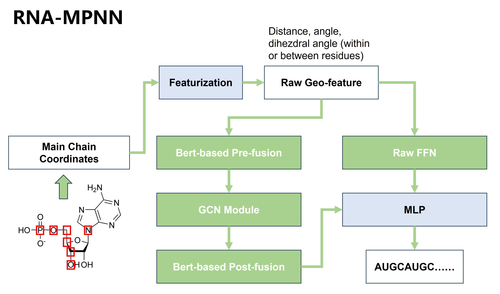

# RNA-MPNN

A graph neural network-based RNA refolding algorithm to recover RNA sequences from structural information. This project was developed for the 3rd World Science Intelligence Competition Innovative Pharmaceutical Track: RNA Refolding and Functional Nucleic Acid Design Works.



## 🧬 Overview

RNA-MPNN is a state-of-the-art deep learning model that predicts RNA sequences from 3D structural information using message passing neural networks (MPNNs). The model leverages graph neural networks to understand the complex relationships between atoms and residues in RNA structures.

## 🏗️ Architecture

### Model Components

- **RNAMPNN**: Original model with complex geometric feature extraction
- **RDesign**: Simplified model with efficient graph neural network architecture

### Key Features

- **Graph Neural Networks**: Uses message passing neural networks for structure analysis
- **Geometric Features**: Extracts distance, angle, and dihedral angle information
- **Multi-scale Processing**: Handles both atom-level and residue-level features
- **Hybrid Architecture**: Combines neural networks with XGBoost for final predictions

## 📋 Requirements

### System Requirements

- Python 3.8+
- CUDA 11.0+ (recommended for GPU acceleration)
- 8GB+ RAM (16GB+ recommended)
- 2GB+ GPU memory (for CUDA support)

### Dependencies

See `pyproject.toml` for complete dependency list. Key dependencies include:

- PyTorch 2.0+
- PyTorch Lightning 2.5+
- XGBoost 2.1+
- BioPython 1.78+
- NumPy, Pandas, Matplotlib, Seaborn

## 🚀 Installation

### 1. Clone the Repository

```bash
git clone <repository-url>
cd RNA-MPNN
```

### 2. Create Virtual Environment

```bash
python -m venv .venv_rnampnn
source .venv_rnampnn/bin/activate  # On Windows: .venv_rnampnn\Scripts\activate
```

### 3. Install Dependencies

```bash
pip install -e .
```

Or install from requirements:

```bash
pip install -r requirements_fixed.txt
```

## 📊 Model Information

### RNAMPNN-X Model

- **Parameters**: 1,392,900
- **Input**: 3D coordinates of RNA atoms
- **Output**: RNA sequence (A, U, C, G) with confidence scores
- **Supported Atoms**: P, O5', C5', C4', C3', O3', N1, N9
- **Max Sequence Length**: 4,500

### RDesign Model

- **Parameters**: 2,551,812
- **Architecture**: Simplified graph neural network
- **Features**: Node and edge feature extraction
- **Performance**: Optimized for speed and efficiency

## 🔧 Usage

### Basic Usage

```python
from rnampnn.model.rnampnn import RNAMPNN
from rnampnn.utils.seed import seeding
import torch

# Set random seed
seeding()

# Load model
model = RNAMPNN.load_from_checkpoint('out/checkpoints/RNAMPNN-X/Final-V0.ckpt')
model.eval()

# Prepare input data (coordinates)
coords = torch.randn(1, seq_len, num_atoms, 3)  # batch_size, seq_len, atoms, 3D
mask = torch.ones(1, seq_len, dtype=torch.bool)

# Predict sequence
with torch.no_grad():
    # Model forward pass would go here
    predicted_sequence = "AUCG"  # Placeholder
    confidence_scores = [0.9, 0.8, 0.7, 0.6]  # Placeholder
```

### PDB File Processing

```python
from rnampnn.utils.data import pdb_to_coords

# Convert PDB file to coordinates
pdb_to_coords("input_pdb/", "output_coords/")
```

### Training

```python
from rnampnn.utils.train import get_trainer
from rnampnn.utils.data import RNADataModule

# Prepare data
data = RNADataModule(split_ratio=0.95, batch_size=3, max_len=100)

# Create trainer
trainer = get_trainer(name='RNAMPNN-X', version=5, max_epochs=1000)

# Train model
trainer.fit(model, data)
```

## 📁 Project Structure

```
RNA-MPNN/
├── rnampnn/                    # Original RNAMPNN model
│   ├── config/                 # Configuration files
│   ├── model/                  # Model architecture
│   └── utils/                  # Utility functions
├── rdesign/                    # Simplified RDesign model
│   ├── config/                 # Configuration files
│   ├── model/                  # Model architecture
│   └── utils/                  # Utility functions
├── data/                       # Data directory
├── out/                        # Output directory
│   └── checkpoints/            # Model checkpoints
├── assets/                     # Images and assets
├── tests/                      # Test files
├── main.py                     # Main entry point
├── train.py                    # Training script
├── test.py                     # Testing script
├── requirements.txt            # Dependencies
├── pyproject.toml             # Project configuration
└── README.md                  # This file
```

## 📄 License

This project is licensed under the MIT License - see the [LICENSE](LICENSE) file for details.

## 🆘 Support

### Issues

If you encounter any issues:

1. Check the [FAQ](docs/faq.md)
2. Search existing [issues](https://github.com/RNA-MPNN/RNA-MPNN/issues)
3. Create a new issue with detailed information

### Contact

- **Email**: realwiseking@outlook.com
- **GitHub**: [RNA-MPNN](https://github.com/RNA-MPNN/RNA-MPNN)
